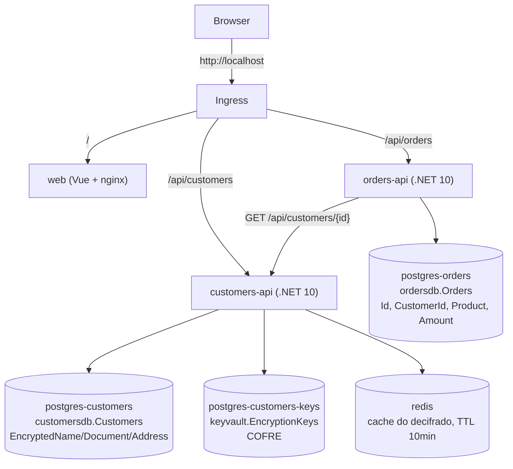

# Crypto-Shredding

POC didática de **crypto-shredding**: cada cliente tem uma chave AES própria. "Esquecer" o cliente
(GDPR/LGPD) = apagar só a chave. O dado cifrado continua no banco para sempre, mas irrecuperável.

- `Customers`: dono do PII. Cifra nome/documento/endereço e guarda em `postgres-customers`. A chave vai
  num banco separado, `postgres-customers-keys` (o cofre). Um Redis cacheia o resultado decifrado (TTL 10min).
- `Orders`: "outro sistema". Guarda só `CustomerId` + dados de negócio, nunca PII, e busca o cliente via
  HTTP na API de `Customers`.

**O ponto central da POC**: apagar a chave em um único lugar (o cofre de `Customers`) torna o dado
irrecuperável em toda a arquitetura — `Orders` não precisa fazer nada para "esquecer" o cliente também.

## Arquitetura



Shred = `DELETE` na linha de `EncryptionKeys` + invalida o Redis. `postgres-customers` e `postgres-orders`
não mudam em nada.

## Estrutura

```text
CryptoShredding/
  Customers/Customers.Core/   # entidades, DbContexts, CryptoService (cifra/decifra/shred)
  Customers/Customers.Api/    # controllers HTTP
  Orders/Orders.Api/          # "outro sistema", consome Customers via HTTP
  web/                        # frontend Vue 3 (abas Clientes / Pedidos)
  docker-compose.yml          # alternativa sem k8s
k8s/                          # manifests (namespace, postgres x3, redis, apis, web, ingress)
kind-config.yaml
scripts/
  up.sh                  # cria o cluster kind, instala ingress-nginx, builda e aplica os manifests
  build.sh               # builda as imagens e carrega no cluster kind
  down.sh                # apaga o cluster kind
  port-forward-dbs.sh    # expõe os bancos/Redis em localhost para um client (DBeaver, RedisInsight...)
```

## Pré-requisitos

Docker, [kind](https://kind.sigs.k8s.io/), kubectl. .NET 10 SDK é opcional (só para rodar fora de containers).

## Rodando

```bash
./scripts/up.sh
```

Acesse **<http://localhost>**:

1. Aba **Clientes**: crie um cliente. O badge `source` mostra `database` na primeira leitura e `cache`
   nas seguintes (TTL 10min).
2. Aba **Pedidos**: crie um pedido para esse cliente. A tabela mostra o nome do cliente (buscado ao vivo
   na `customers-api`).
3. Clique em **Shred (apagar chave)** na aba Clientes.
4. Volte para **Pedidos** e recarregue: o mesmo pedido agora mostra **"Cliente removido (dado esquecido)"**
   — sem que `Orders` tenha feito nada.

Para inspecionar os bancos direto:

```bash
kubectl -n crypto-shredding exec deploy/postgres-customers -- psql -U postgres -d customersdb -c 'SELECT * FROM "Customers";'
kubectl -n crypto-shredding exec deploy/postgres-customers-keys -- psql -U postgres -d keyvault -c 'SELECT * FROM "EncryptionKeys";'
kubectl -n crypto-shredding exec deploy/redis -- redis-cli KEYS 'customer:*'
kubectl -n crypto-shredding exec deploy/postgres-orders -- psql -U postgres -d ordersdb -c 'SELECT * FROM "Orders";'
```

Ou, para usar um client gráfico (DBeaver, TablePlus, RedisInsight) via `localhost`:

```bash
./scripts/port-forward-dbs.sh
```

Para encerrar:

```bash
./scripts/down.sh
```

## Sem Kubernetes (docker-compose)

```bash
cd CryptoShredding
docker-compose up --build
```

- Frontend: <http://localhost:8081>
- API de clientes: <http://localhost:5231/api/customers>
- API de pedidos: <http://localhost:5122/api/orders>
